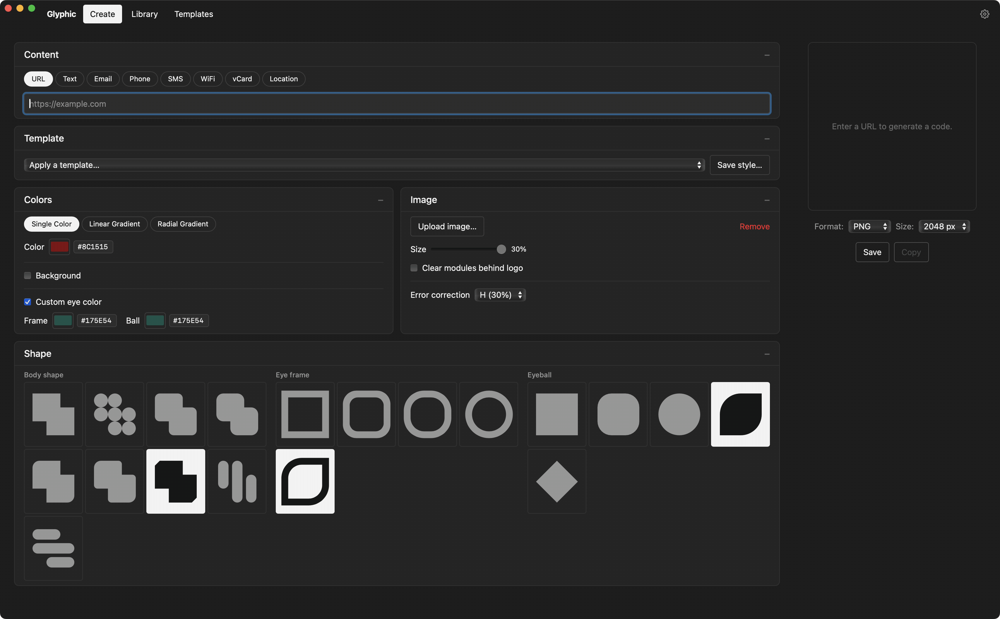

# Glyphic

Cross-platform desktop QR code studio (Tauri 2 + Vue 3). Design styled QR codes —
colors, gradients, custom eyes, logos, body/eye shapes — export as SVG, PNG, JPEG,
WebP, PDF, or EPS, and manage a library of past codes and reusable style templates.

## Development

Uses [just](https://github.com/casey/just):

- `just setup` — install dependencies
- `just dev` — run the app with hot reload
- `just test` — frontend + Rust tests
- `just check` — typecheck + all tests (what CI runs)
- `just build` — release bundles for this platform
- `just icons` — regenerate placeholder icons (overwrites all)

## Replacing placeholder icons

Shape-picker icons (body, eye frame, eyeball) are generated from the QR engine's
own geometry (`src/lib/shape-previews.ts`), so each button always depicts exactly
what that shape renders in a real QR code — there's nothing to replace.

The remaining icons are standalone files in `src/icons/` (24x24 viewBox,
`fill="currentColor"`). Replace a file, keep the name, and the UI picks it up:
`action-<name>.svg`. `npm run icons` regenerates these placeholders.

## Data

Templates, history, and settings are JSON files in the OS app-data directory
(`~/Library/Application Support/dev.duncaneddy.glyphic` on macOS). Template files
are self-contained and shareable.
